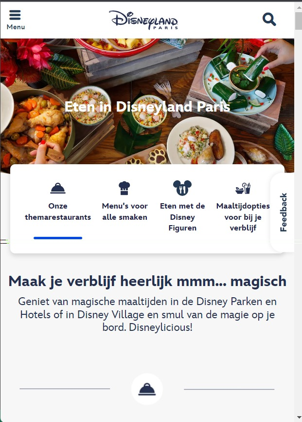

# Procesverslag
Markdown is een simpele manier om HTML te schrijven.  
Markdown cheat cheet: [Hulp bij het schrijven van Markdown](https://github.com/adam-p/markdown-here/wiki/Markdown-Cheatsheet).

Nb. De standaardstructuur en de spartaanse opmaak van de README.md zijn helemaal prima. Het gaat om de inhoud van je procesverslag. Besteedt de tijd voor pracht en praal aan je website.

Nb. Door *open* toe te voegen aan een *details* element kun je deze standaard open zetten. Fijn om dat steeds voor de relevante stuk(ken) te doen.

## Jij

  
uitwerken voor kick-off werkgroep

  ### Auteur:
  Zoë de Ruiter

  #### Je startniveau:
  blauw

  #### Je focus:
  responsive
 

## Je website

  
uitwerken voor kick-off werkgroep

  ### Je opdracht:
  <a href="https://www.disneylandparis.com/nl-nl/voorjaar-en-lente/?ecid=SEM_IP_S_4469596408-c-98352319814-315237829-536337516453-Exact&gclsrc=aw.ds&&mkwid=J8vamOKm&gclid=CjwKCAiA9dGqBhAqEiwAmRpTCxU7LfGoCtl5_ReMsC8tNl-D3A0mpkN-tsGK7l_3xbDD83kV0nTl_xoCJ0IQAvD_BwE&pcrid=536337516453&pmt=e&pkw=disneyland+parijs">Disneyland parijs</a>

  #### Screenshot(s) van de eerste pagina (small screen): 
  Disneyland parijs
  

  #### Screenshot(s) van de tweede pagina (small screen):
  hier de naam van de pagina  
  
 

## Toegankelijkheidstest 1/2 (week 1)

  
uitwerken na test in 2e werkgroep

  ### Bevindingen
  De screenreader deed het erg goed, hij pakte alles op en las de tekt goed voor.De gidsen die disney aanbied hebben zelf ook een screenreader dit kan wel vervelend zijn voor mensen die gebruik maken van een reader, want zo kunnen er twee door elkaar heen gaan lopen. om snel te vinden wat je zoekt is het wel wat lastiger, want je gaat bij elke pagina overal langs. Je kan wel er snel doorheen skippen als je bekent bent met de site of al snel hoort dat dit niet is wat je zoekt.

  Uit de checklist kwam eigenlijk dat het een vrij goede site is, totdat ik naar de code ging kijken. Alles is geschreven in Div's, dus qua code is het een hele slechte site.

## Breakdownschets (week 1)

  
uitwerken na afloop 3e werkgroep

  ### de hele pagina: 
  

  ### dynamisch deel (bijv menu): 
  

  ### wellicht nog een dynamisch deel (bijv filter): 
  

## Voortgang 1 (week 2)

  
uitwerken voor 1e voortgang

  ### Stand van zaken
  Alle losse opdrachten gaan erg goed, stap voor stap aan het werk lukt een stuk beter dan in 1x een grote site namaken. Het is een beetje veel voor mijn gevoel. Hier helpen de breakdown schetsen wel bij gelukkig. Ik loop voor mijn gevoel wel een beetje achter met het namaken van de site, dus ik  ga hier van het weekend een inhaalslag mee maken. 

  ### Agenda voor meeting
  samen met je groepje opstellen

  | student 1      | student 2          | student 3    | student 4        | student 5
  | breakdownschets| wat kan je doen    | Vraag over   | button in een    | font face
  | nakijken       | inplaats van Div   | html/css     | button           |
  |                |                    | uitklap elle-|                  |
  |                |                    | menten       |                  |

  ### Verslag van meeting
  hier na afloop snel de uitkomsten van de meeting vastleggen

  - punt 1
  - punt 2
  - nog een punt
  - ...

## Voortgang 2 (week 3)

  
uitwerken voor 2e voortgang

  ### Stand van zaken
  hier dit ging goed & dit was lastig (neem ook screenshots op van delen van je website en code)

  ### Agenda voor meeting
  samen met je groepje opstellen

  | student 1      | student 2          | student 3    | student 4        |
  | ---            | ---                | ---          | ---              |
  | dit bespreken  | en dit             | en ik dit    | en dan ik dat    |
  | en dat ook nog | dit als er tijd is | nog een punt | dit wil ik zeker |
  | ...            | ...                | ...          | ...              |

  ### Verslag van meeting
  hier na afloop snel de uitkomsten van de meeting vastleggen

  - punt 1
  - punt 2
  - nog een punt
- ...

## Toegankelijkheidstest 2/2 (week 4)

  
uitwerken na test in 9e werkgroep

  ### Bevindingen
  Lijst met je bevindingen die in de test naar voren kwamen (geef ook aan wat er verbeterd is):

## Voortgang 3 (week 4)

  
uitwerken voor 3e voortgang

  ### Stand van zaken
  hier dit ging goed & dit was lastig (neem ook screenshots op van delen van je website en code)

  ### Agenda voor meeting
  samen met je groepje opstellen

  | student 1      | student 2          | student 3    | student 4        |
  | ---            | ---                | ---          | ---              |
  | dit bespreken  | en dit             | en ik dit    | en dan ik dat    |
  | en dat ook nog | dit als er tijd is | nog een punt | dit wil ik zeker |
  | ...            | ...                | ...          | ...              |

  ### Verslag van meeting
  hier na afloop snel de uitkomsten van de meeting vastleggen

  - punt 1
  - punt 2
  - nog een punt
  - ...

## Eindgesprek (week 5)

  
uitwerken voor eindgesprek

  ### Je uitkomst - karakteristiek screenshots:
  

  ### Dit ging goed/Heb ik geleerd: 
  Korte omschrijving met plaatjes

  

  ### Dit was lastig/Is niet gelukt:
  Korte omschrijving met plaatjes

  

## Bronnenlijst

  
continu bijhouden terwijl je werkt

  Nb. Wees specifiek ('css-tricks' als bron is bijv. niet specifiek genoeg). 
  Nb. ChatGpT en andere AI horen er ook bij.
  Nb. Vermeld de bronnen ook in je code.

  1. bron 1
  2. bron 2
  3. ...

