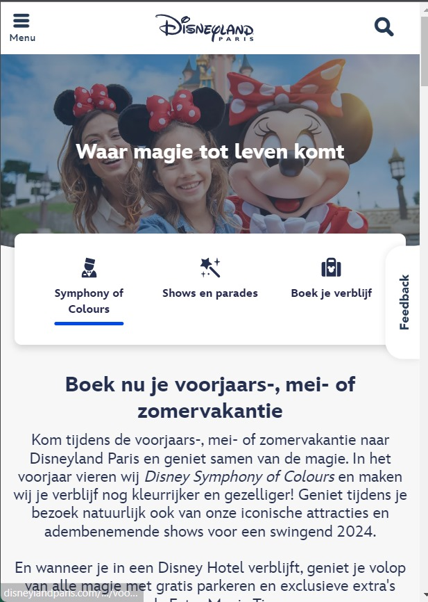
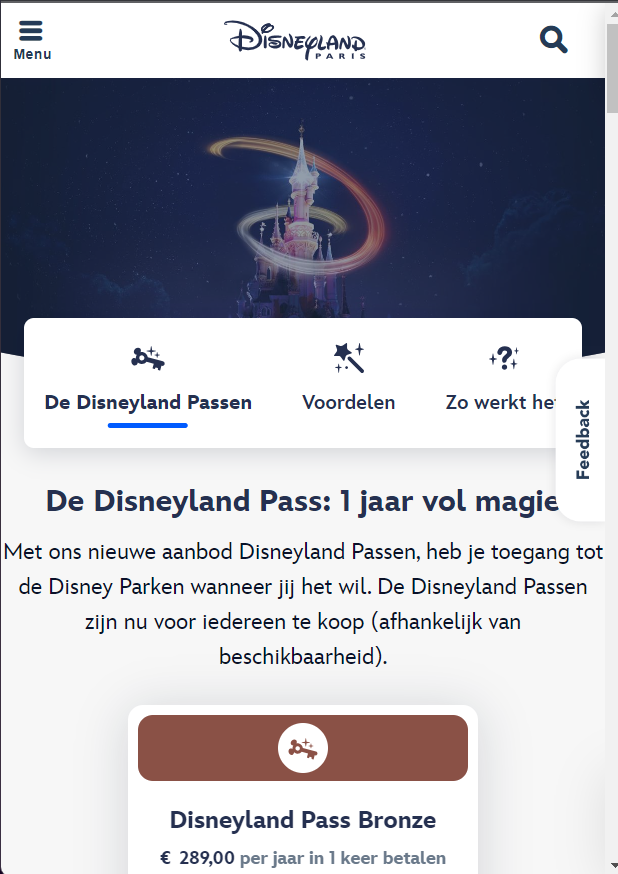
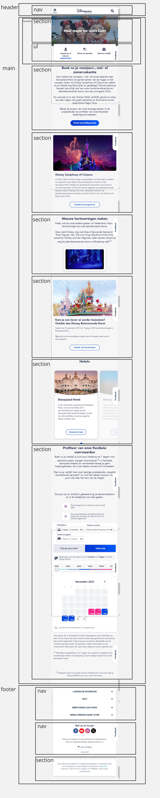
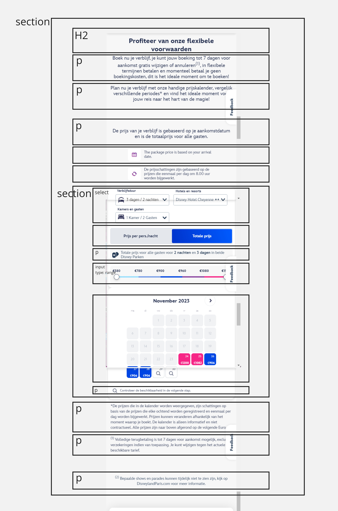
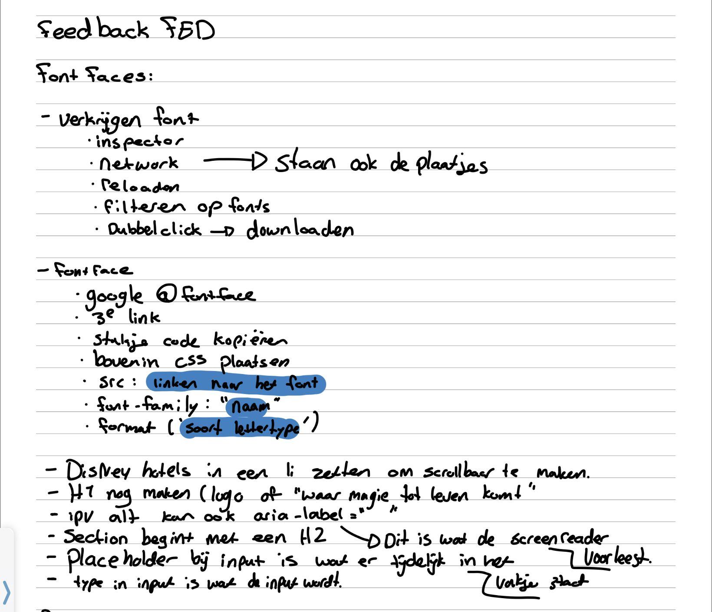
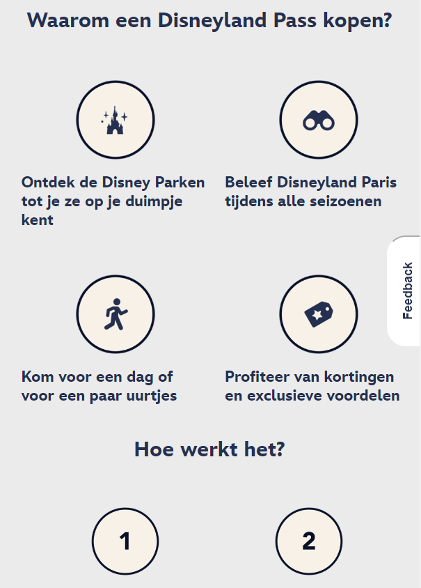
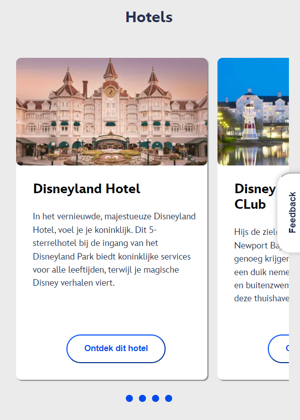
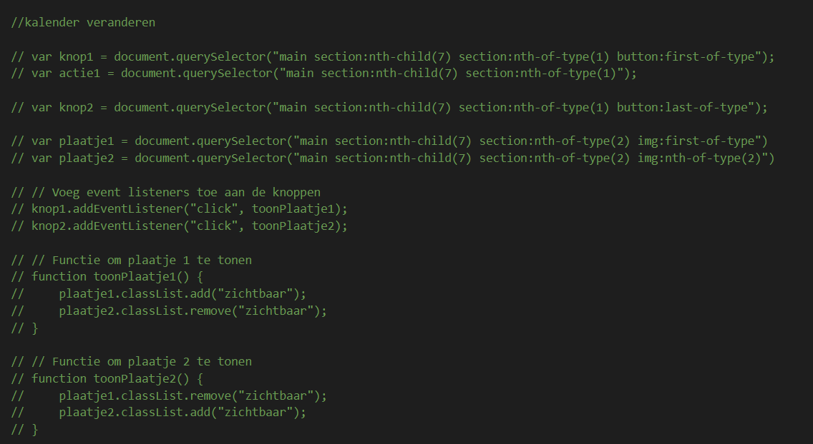

# Procesverslag
Markdown is een simpele manier om HTML te schrijven.  
Markdown cheat cheet: [Hulp bij het schrijven van Markdown](https://github.com/adam-p/markdown-here/wiki/Markdown-Cheatsheet).

Nb. De standaardstructuur en de spartaanse opmaak van de README.md zijn helemaal prima. Het gaat om de inhoud van je procesverslag. Besteedt de tijd voor pracht en praal aan je website.

Nb. Door *open* toe te voegen aan een *details* element kun je deze standaard open zetten. Fijn om dat steeds voor de relevante stuk(ken) te doen.

## Jij

  
uitwerken voor kick-off werkgroep

  ### Auteur:
  Zoë de Ruiter

  #### Je startniveau:
  blauw

  #### Je focus:
  responsive
 

## Je website

  
uitwerken voor kick-off werkgroep

  ### Je opdracht:
  <a href="https://www.disneylandparis.com/nl-nl/voorjaar-en-lente/?ecid=SEM_IP_S_4469596408-c-98352319814-315237829-536337516453-Exact&gclsrc=aw.ds&&mkwid=J8vamOKm&gclid=CjwKCAiA9dGqBhAqEiwAmRpTCxU7LfGoCtl5_ReMsC8tNl-D3A0mpkN-tsGK7l_3xbDD83kV0nTl_xoCJ0IQAvD_BwE&pcrid=536337516453&pmt=e&pkw=disneyland+parijs">Disneyland parijs</a>

  #### Screenshot(s) van de eerste pagina (small screen): 
  Disneyland parijs
  

  #### Screenshot(s) van de tweede pagina (small screen):
  hier de naam van de pagina  
  
 

## Toegankelijkheidstest 1/2 (week 1)

  
uitwerken na test in 2e werkgroep

  ### Bevindingen
  De screenreader deed het erg goed, hij pakte alles op en las de tekt goed voor.De gidsen die disney aanbied hebben zelf ook een screenreader dit kan wel vervelend zijn voor mensen die gebruik maken van een reader, want zo kunnen er twee door elkaar heen gaan lopen. om snel te vinden wat je zoekt is het wel wat lastiger, want je gaat bij elke pagina overal langs. Je kan wel er snel doorheen skippen als je bekent bent met de site of al snel hoort dat dit niet is wat je zoekt.

  Uit de checklist kwam eigenlijk dat het een vrij goede site is, totdat ik naar de code ging kijken. Alles is geschreven in Div's, dus qua code is het een hele slechte site.

## Breakdownschets (week 1)

  
uitwerken na afloop 3e werkgroep

  ### de hele pagina: 
  

  ### dynamisch deel (bijv menu): 
  

  ### wellicht nog een dynamisch deel (bijv filter): 
  

## Voortgang 1 (week 2)

  
uitwerken voor 1e voortgang

  ### Stand van zaken
  Alle losse opdrachten gaan erg goed, stap voor stap aan het werk lukt een stuk beter dan in 1x een grote site namaken. Het is een beetje veel voor mijn gevoel. Hier helpen de breakdown schetsen wel bij gelukkig. Ik loop voor mijn gevoel wel een beetje achter met het namaken van de site, dus ik  ga hier van het weekend een inhaalslag mee maken. 

  ### Agenda voor meeting
  samen met je groepje opstellen

  | student 1      | student 2          | student 3    | student 4        | student 5
  | breakdownschets| wat kan je doen    | Vraag over   | button in een    | font face
  | nakijken       | inplaats van Div   | html/css     | button           |
  |                |                    | uitklap elle-|                  |
  |                |                    | menten       |                  |

  ### Verslag van meeting
  

  - Ik zelf heb het meeste gehad aan de font faces
  - aria labes en
  - de uitleg over mijn footer.

## Voortgang 2 (week 3)

  
uitwerken voor 2e voortgang

  ### Stand van zaken
  Ik ben deze week een stuk meer beig geweest met css, het meeste gaat goed, maar zodra ik ergens tegenaan loop kom ik zelf eigenlijk niet op de oplossing. Ook niet met behulp van het internet en dit vind ik wel jammer, want ik wil het graag zelf kunnen aangezien het om vrij simpele dingen soms gaat. Verder is het het zelfde als vorige week, de losse opdrachten gaan erg goed, maar het maken van mn eigen site gaat wat lastiger.

  ### Agenda voor meeting
  samen met je groepje opstellen

  | student 1:    een button in het midden krijgen, een verticale schuifbare lijst maken, eventueel youtube filmpje in html zetten
  | student 2:    css root, responsive   
  | student 3:    downloaden gif, postitioneren
  | student 4        

  ### Verslag van meeting
  heb het filmpje in html gekregen, ik had het goede element, alleen de verkeerde manier van de video aanspreken.
  verder staan alle buttons na veel moeite nu in het midden en is de verticale lijst nu schuibaar, helaas heeft deze nog wel een scrollbar. die kregen we niet weg.

## Toegankelijkheidstest 2/2 (week 4)

  
uitwerken na test in 9e werkgroep

  ### Bevindingen
  uit de screenreader kwam dat sommige dingen nog niet goed opgepakt worden of dat sommige dingen gelezen worden terwijl dit niet hoort. dit heb ik geprobeerd op te lossen met airalabels en sommige alts weg te halen

  uit de wcag lijst komt het volgende:
  - voor blinde zijn de buttons en links nu duidelijk waar ze voor zijn door een arialabel toe te voegen.
  - de code van disney zelf waren allemaal divs, dus in dat opzicht heb ik de hele html verbeterd, ik heb h1,h2,h3 toegepast, ul,li buttons en a elemementen, alles behalve de divs. 
  - het filmpje op de site staat nu op pauze en je kan hem zelf aanzetten

## Voortgang 3 (week 4)

  
uitwerken voor 3e voortgang

  ### Stand van zaken
  Deze week loop ik voor mijn gevoel eindelijk een beetje bij, ik heb een html css en java. Ik loop nog tegen een paar dingetjes aan, maar verder gaat het nu eindelijk wel lekker. Ik moet wel nog beginnen aan de tweede pagina, dat ga ik van het weekend doen. Ik weet nog niet goed hoe het werkt om 3 css bestanden te hebben voor 2 pagina's, maar hier kom ik vast wel uit.

  ### Agenda voor meeting
  samen met je groepje opstellen

  student 1: - sections voor een deel een andere kleur geven en die mee laten groeien
  student 2: - section in section in section mag niet dus wat dan wel
  - schuifbalk weghalen
  student 3: geen vragen

  ### Verslag van meeting
  de oplossing voor de 3 sections is geworden dan ik het plaatje gewoon in een p kan zetten, dit lost ook gelijk andere problemen op in mijn site. Verder hebben we opgezocht hoe ik de schuifbalk weg kan krijgen en dit ging met een vrij simpele code, maar je moet het wel weten.

## Eindgesprek (week 5)

  
uitwerken voor eindgesprek

  ### Je uitkomst - karakteristiek screenshots:
  

  ### Dit ging goed/Heb ik geleerd: 
  wat erg goed ging is het niet opgeven als iets niet lukt. Ik nam er gewoon even afstand van en ging wat anders doen. als ik er later dan weer naar ging kijken lukte het vaak wel. en ik ben natuurlijk gewoon erg trots op het eindrestultaat het is gewoon twee druppels water, maar dan wel met een goede code ipv div's. Ook het responsive maken van de site ben ik trots op, ik had voor dit vak namelijk geen idee hoe dat werkte en ik vind dat ik het best goed heb gedaan zo.

  
  

  ### Dit was lastig/Is niet gelukt:
  het maken van de micro interactie vond ik heel moeilijk, heb van alles geprobeerd en gezocht, maar het wilde niet lukken.

  

## Bronnenlijst

  
continu bijhouden terwijl je werkt

  Nb. Wees specifiek ('css-tricks' als bron is bijv. niet specifiek genoeg). 
  Nb. ChatGpT en andere AI horen er ook bij.
  Nb. Vermeld de bronnen ook in je code.

  1. https://codepen.io/Zoe-deRuiter/pen/gOqzPKG 
  2. https://codepen.io/shooft/pen/LYqrpWr
  3. https://codepen.io/shooft/pen/mdvobaY 
  4. https://css-tricks.com/snippets/css/a-guide-to-flexbox/ 

